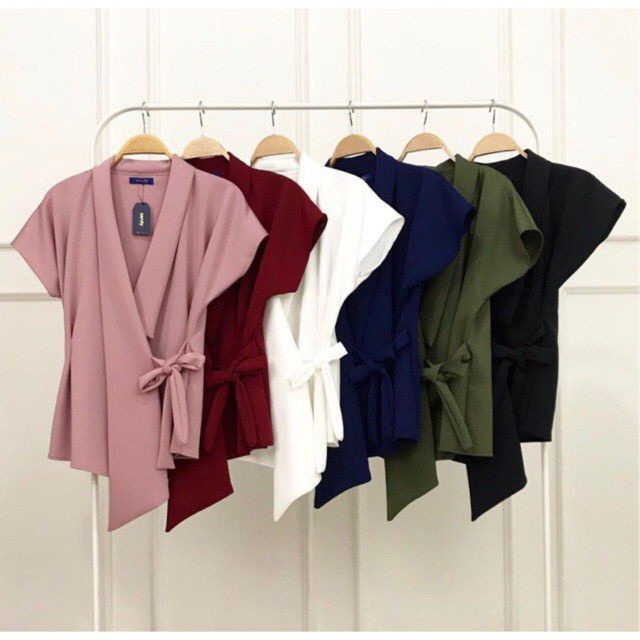
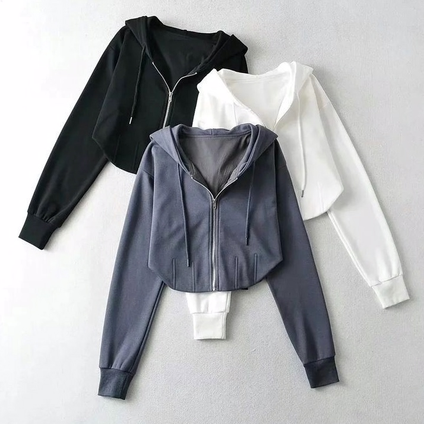
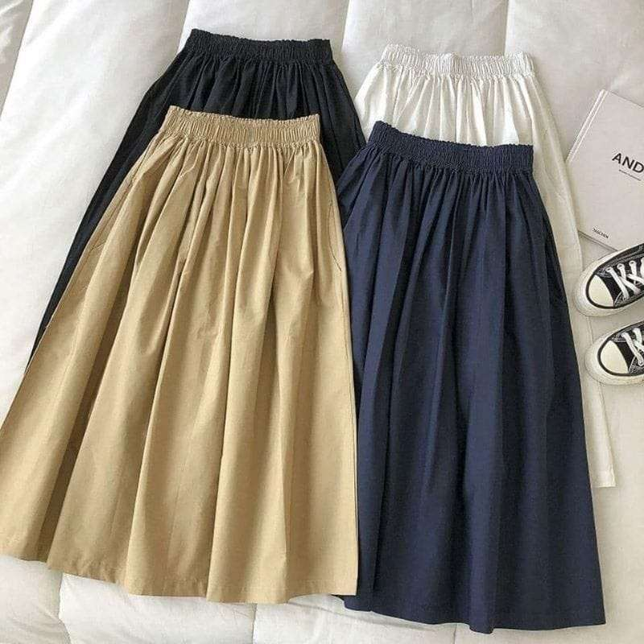

# Fashion Store App

Aplikasi mobile toko fashion yang dikembangkan menggunakan Flutter. Aplikasi ini menyediakan pengalaman belanja fashion yang intuitif dan menarik bagi pengguna.

## Fitur Utama

- Autentikasi pengguna (login/register)
- Katalog produk fashion dengan kategori
- Pencarian dan filter produk
- Keranjang belanja
- Wishlist untuk menyimpan produk favorit
- Profil pengguna
- Proses checkout dan pembayaran

## Teknologi

- Flutter
- Dart
- Material Design

## Screenshot

  
  
  

## Instalasi

1. Clone repository ini
2. Jalankan `flutter pub get` untuk menginstall dependencies
3. Jalankan `flutter run` untuk memulai aplikasi